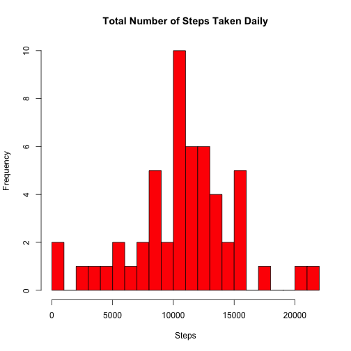
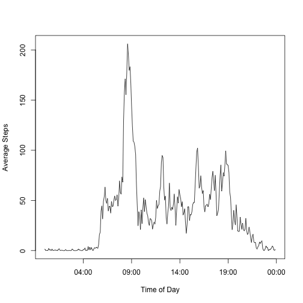
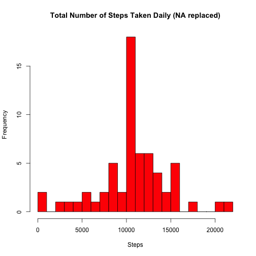
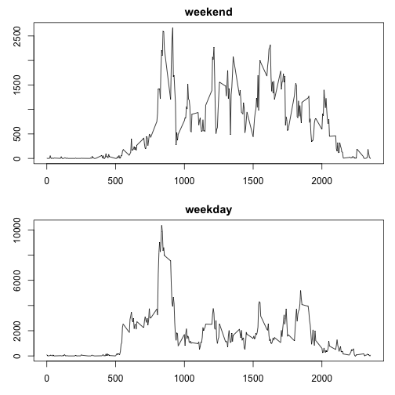

# Reproducible Research: Peer Assessment 1


## Loading and preprocessing the data


```r
step_data <- read.table("activity.csv", sep=",", header=TRUE)
new_date <- as.Date(step_data$date, "%Y-%m-%d")
new_interval <- sprintf("%04d", step_data$interval)
dateTime <- strptime(paste(new_date, new_interval), format= "%Y-%m-%d %H%M")
pa1_data <- data.frame(dateTime, step_data$steps)
names(pa1_data)[2] <- "steps"
```

## What is mean total number of steps taken per day?


```r
step_data <- read.table("activity.csv", sep=",", header=TRUE)

hist_df <- aggregate(step_data$steps, by=list(step_data$date), FUN = sum)
colnames(hist_df) <- c("date", "steps")
hist_df$date <- as.Date(hist_df$date, "%Y-%m-%d")
hist_df2 <- hist_df[complete.cases(hist_df), ]
```

Create the histogram


```r
par(mfrow = c(1,1), bg = "white")

hist(hist_df2$steps, col = "red", breaks = 20, main = "Total Number of Steps Taken Daily", xlab = "Steps")
```

 

Mean & Median: 


```r
mean(hist_df2$steps)
```

```
## [1] 10766
```

```r
median(hist_df2$steps)
```

```
## [1] 10765
```


## What is the average daily activity pattern?


```r
plot_df <- aggregate(step_data$steps, by=list(step_data$interval), FUN = mean, na.rm=TRUE)
colnames(plot_df) <- c("interval", "steps")

plot_df$interval <- sprintf("%04d", plot_df$interval)
plot_df$interval <- strptime(plot_df$interval, format="%H%M")
```

Histogram

```r
with(plot_df, plot(interval, steps, type = "l", 
    ylab = "Average Steps", xlab = "Time of Day"))
```

 

```r
plot_df[which.max(plot_df$steps),1]
```

```
## [1] "2014-07-20 08:35:00 PDT"
```

## Imputing missing values

How many na rows: 

```r
sum(is.na(step_data$steps))
```

```
## [1] 2304
```

Replace with averages


```r
narm_df <- step_data
narm_df$interval <- sprintf("%04d", narm_df$interval)

avgint_df <- aggregate(step_data$steps, by=list(step_data$interval), FUN = mean, na.rm=TRUE)
colnames(avgint_df) <- c("interval", "steps")
avgint_df$interval <- sprintf("%04d", avgint_df$interval)

i <- 1
while (i <= nrow(narm_df)) {
  if(is.na(narm_df$steps[i])) {
    sub_interval <- narm_df$interval[i]
    lookup <- subset(avgint_df, interval == sub_interval)
    narm_df$steps[i] <- lookup$steps
  }
  i <- i + 1
}

narm_df2 <- aggregate(narm_df$steps, by=list(narm_df$date), FUN = sum)
colnames(narm_df2) <- c("date", "steps")
```

New histogram


```r
hist(narm_df2$steps, col = "red", breaks = 20, main = "Total Number of Steps Taken Daily (NA replaced)", xlab = "Steps")
```

 

Mean & Median:


```r
mean(narm_df2$steps)
```

```
## [1] 10766
```

```r
median(narm_df2$steps)
```

```
## [1] 10766
```

## Are there differences in activity patterns between weekdays and weekends?

create weekend/weekday data frame


```r
weekdays_df <- weekdays(as.Date(step_data$date))

i <- 1
while (i <= length(weekdays_df)) {
  if(weekdays_df[i] == "Saturday" || weekdays_df[i] == "Sunday") {
    weekdays_df[i] <- "weekend"
  }
  else {
    weekdays_df[i] <- "weekday"
  }
  i <- i + 1
}

week_df <- data.frame(narm_df,weekdays_df)
agweek_df <- aggregate(week_df$steps, by=list(week_df$interval,week_df$weekdays_df), FUN = sum, na.rm=TRUE)
colnames(agweek_df) <- c("interval", "weekday_df", "steps")
```

draw charts:


```r
par(mfrow = c(2,1), mar=c(3,3,2,1), bg="white")
with(subset(agweek_df,weekday_df=="weekend"), plot(interval, steps, type="l", main = "weekend", ylab = "avg number of steps", xlab = "interval"))
with(subset(agweek_df,weekday_df=="weekday"), plot(interval, steps, type="l", main = "weekday", ylab = "avg number of steps", xlab = "interval"))
```

 


